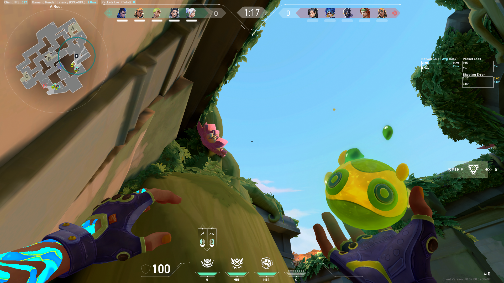
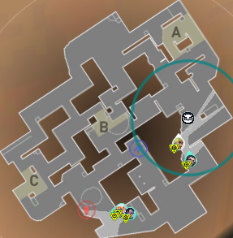

# Valorant Minimap Extractor

A quick Valorant minimap extractor with no deep learning involved.

## Dependencies

- opencv-contrib-python (https://pypi.org/project/opencv-contrib-python/)

## Usage

- Setup environment with "pip install opencv-contrib-python"
- cd to project directory
- python extract_minimap.py [filename] --map [map] --mode [exact or boundary]

For more details on the arguments, run "python extract_minimap.py --help".

## Adding a New Map

1. Get minimap image.
2. Crop the content of minimap image to its content (no transparent padding).
3. Place image in map_templates/
4. In constants.py, create new map constant variable, and add it to SUPPORTED_MAPS.

### TODO

- Could cleanup the current implementation in feature_match.py. There
is some logic which is repeated.
- Automatic map detector. Could be done by gathering similarity scores
among all maps as templates and assuming it's the one with the highest
similarity score.
- Video processing. Split video into individual frames, and process each one.
Not sure how intensive SIFT is, but SURF may need to be implemented to facilitate
this sort of large-scale processing.
- Parallel processing. Would be nice to process many images simultaneously.
- Padding for extracting the exact minimap. This is trivial when extending the
borders of the extracted minimap. For the transparent inner parts, could iteratively
include all pixels directly adjacent to the current pixel that is opaque.